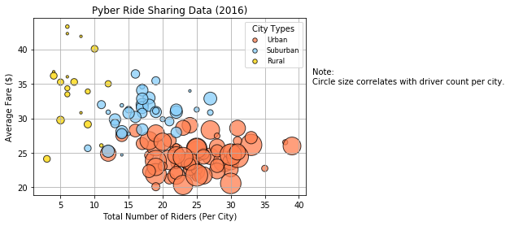
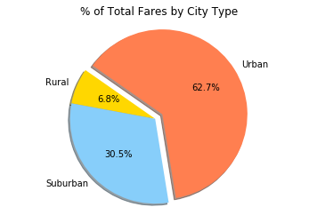
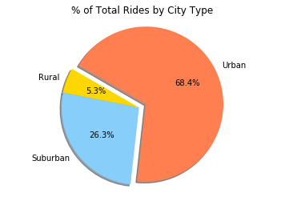
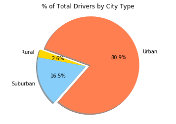

## Pyber Observable Trends Based on the Data
* The law of supply and demand is evident in the relationship between city type, the number of drivers, as well as the number of rides and fares.
* The more drivers there are, the more rides and the lower the fare is.
* Drivers in urban cities dominate with 81% of the total drivers, making up 68% of total rides, but only 63% of total fares.
* Drivers in rural cities are lacking with only 3% of the total drivers, making up 5% of total rides, but contributing 7% of the total fare.
* The most surprising are suburban city drivers making up 17% of the total drivers, but contributing 26% of the total rides, making up 31% of the total fares.


```python
%matplotlib inline
# Dependencies and Setup
import matplotlib.pyplot as plt
import pandas as pd
import numpy as np

# File to Load (Remember to change these)
city_data_to_load = "data/city_data.csv"
ride_data_to_load = "data/ride_data.csv"

# Read the City and Ride Data
city_data_df = pd.read_csv(city_data_to_load)
ride_data_df = pd.read_csv(ride_data_to_load)
```


```python
city_data_df.head()
```


<div>
<style scoped>
    .dataframe tbody tr th:only-of-type {
        vertical-align: middle;
    }

    .dataframe tbody tr th {
        vertical-align: top;
    }

    .dataframe thead th {
        text-align: right;
    }
</style>
<table border="1" class="dataframe">
  <thead>
    <tr style="text-align: right;">
      <th></th>
      <th>city</th>
      <th>driver_count</th>
      <th>type</th>
    </tr>
  </thead>
  <tbody>
    <tr>
      <th>0</th>
      <td>Richardfort</td>
      <td>38</td>
      <td>Urban</td>
    </tr>
    <tr>
      <th>1</th>
      <td>Williamsstad</td>
      <td>59</td>
      <td>Urban</td>
    </tr>
    <tr>
      <th>2</th>
      <td>Port Angela</td>
      <td>67</td>
      <td>Urban</td>
    </tr>
    <tr>
      <th>3</th>
      <td>Rodneyfort</td>
      <td>34</td>
      <td>Urban</td>
    </tr>
    <tr>
      <th>4</th>
      <td>West Robert</td>
      <td>39</td>
      <td>Urban</td>
    </tr>
  </tbody>
</table>
</div>


```python
ride_data_df.head()
```


<div>
<style scoped>
    .dataframe tbody tr th:only-of-type {
        vertical-align: middle;
    }

    .dataframe tbody tr th {
        vertical-align: top;
    }

    .dataframe thead th {
        text-align: right;
    }
</style>
<table border="1" class="dataframe">
  <thead>
    <tr style="text-align: right;">
      <th></th>
      <th>city</th>
      <th>date</th>
      <th>fare</th>
      <th>ride_id</th>
    </tr>
  </thead>
  <tbody>
    <tr>
      <th>0</th>
      <td>Lake Jonathanshire</td>
      <td>2018-01-14 10:14:22</td>
      <td>13.83</td>
      <td>5739410935873</td>
    </tr>
    <tr>
      <th>1</th>
      <td>South Michelleport</td>
      <td>2018-03-04 18:24:09</td>
      <td>30.24</td>
      <td>2343912425577</td>
    </tr>
    <tr>
      <th>2</th>
      <td>Port Samanthamouth</td>
      <td>2018-02-24 04:29:00</td>
      <td>33.44</td>
      <td>2005065760003</td>
    </tr>
    <tr>
      <th>3</th>
      <td>Rodneyfort</td>
      <td>2018-02-10 23:22:03</td>
      <td>23.44</td>
      <td>5149245426178</td>
    </tr>
    <tr>
      <th>4</th>
      <td>South Jack</td>
      <td>2018-03-06 04:28:35</td>
      <td>34.58</td>
      <td>3908451377344</td>
    </tr>
  </tbody>
</table>
</div>


```python
# Combine the data into a single dataset
pyber_df = pd.merge(ride_data_df, city_data_df, on="city")

# Display the data table for preview
pyber_df.drop_duplicates("city").reset_index(drop=True).head()
```


<div>
<style scoped>
    .dataframe tbody tr th:only-of-type {
        vertical-align: middle;
    }

    .dataframe tbody tr th {
        vertical-align: top;
    }

    .dataframe thead th {
        text-align: right;
    }
</style>
<table border="1" class="dataframe">
  <thead>
    <tr style="text-align: right;">
      <th></th>
      <th>city</th>
      <th>date</th>
      <th>fare</th>
      <th>ride_id</th>
      <th>driver_count</th>
      <th>type</th>
    </tr>
  </thead>
  <tbody>
    <tr>
      <th>0</th>
      <td>Lake Jonathanshire</td>
      <td>2018-01-14 10:14:22</td>
      <td>13.83</td>
      <td>5739410935873</td>
      <td>5</td>
      <td>Urban</td>
    </tr>
    <tr>
      <th>1</th>
      <td>South Michelleport</td>
      <td>2018-03-04 18:24:09</td>
      <td>30.24</td>
      <td>2343912425577</td>
      <td>72</td>
      <td>Urban</td>
    </tr>
    <tr>
      <th>2</th>
      <td>Port Samanthamouth</td>
      <td>2018-02-24 04:29:00</td>
      <td>33.44</td>
      <td>2005065760003</td>
      <td>57</td>
      <td>Urban</td>
    </tr>
    <tr>
      <th>3</th>
      <td>Rodneyfort</td>
      <td>2018-02-10 23:22:03</td>
      <td>23.44</td>
      <td>5149245426178</td>
      <td>34</td>
      <td>Urban</td>
    </tr>
    <tr>
      <th>4</th>
      <td>South Jack</td>
      <td>2018-03-06 04:28:35</td>
      <td>34.58</td>
      <td>3908451377344</td>
      <td>46</td>
      <td>Urban</td>
    </tr>
  </tbody>
</table>
</div>


## Bubble Plot of Ride Sharing Data


```python
#create variables for city type, used for scatter plot
urban = pyber_df[pyber_df["type"] == "Urban"]
suburban = pyber_df[pyber_df["type"] == "Suburban"]
rural = pyber_df[pyber_df["type"] == "Rural"]
```


```python
# Obtain the x and y coordinates for each of the three city types
urban_ride_count = urban.groupby(["city"])["ride_id"].count()
urban_fare_avg = urban.groupby(["city"])["fare"].mean()
urban_driver_count = urban.groupby(["city"])["driver_count"].mean()

suburban_ride_count = suburban.groupby(["city"])["ride_id"].count()
suburban_fare_avg = suburban.groupby(["city"])["fare"].mean()
suburban_driver_count = suburban.groupby(["city"])["driver_count"].mean()

rural_ride_count = rural.groupby(["city"])["ride_id"].count()
rural_fare_avg = rural.groupby(["city"])["fare"].mean()
rural_driver_count = rural.groupby(["city"])["driver_count"].mean()

# Build the scatter plots for each city types
plt.scatter(urban_ride_count, urban_fare_avg, s = urban_driver_count*10,
            color = "coral", edgecolor = "black", label = "Urban", alpha = 0.75)

plt.scatter(suburban_ride_count, suburban_fare_avg, s = suburban_driver_count*10,
            color = "lightskyblue", edgecolor = "black", label = "Suburban", alpha = 0.75)

plt.scatter(rural_ride_count, rural_fare_avg, s = rural_driver_count*10,
            color = "gold", edgecolor = "black", label = "Rural", alpha = 0.75)

# Incorporate the other graph properties
plt.xlim(1, 41)
plt.ylim(18.9,44.5)

plt.title("Pyber Ride Sharing Data (2016)")
plt.xlabel("Total Number of Riders (Per City)")
plt.ylabel("Average Fare ($)")
plt.grid(True)

# Create a legend
lgnd = plt.legend(loc="best", title="City Types", fontsize="small")
lgnd.legendHandles[0]._sizes = [30]
lgnd.legendHandles[1]._sizes = [30]
lgnd.legendHandles[2]._sizes = [30]

# Incorporate a text label regarding circle size
plt.annotate("Note: \nCircle size correlates with driver count per city.", xy=(30, 40), xytext=(42, 35))

# Show plot
plt.show()
```





## Total Fares by City Type


```python
# Calculate Type Fares
total_fare = pyber_df.groupby("type")["fare"].sum()

# Build Pie Chart
city_type = ["Rural", "Suburban", "Urban"]
colors = ["gold", "lightskyblue", "coral"]
explode = (0, 0, 0.1)

plt.title("% of Total Fares by City Type")

plt.pie(total_fare, explode = explode, labels = city_type, colors = colors,
        autopct = "%1.1f%%", shadow = True, startangle = 145)

plt.axis("equal")

# Save Figure
plt.savefig("pyber_totalfarescitytype_pie.png")

# Show Figure
plt.show()
```





## Total Rides by City Type


```python
# Calculate Type Fares
total_ride = pyber_df.groupby("type")["ride_id"].count()

# Build Pie Chart
city_type = ["Rural", "Suburban", "Urban"]
colors = ["gold", "lightskyblue", "coral"]
explode = (0, 0, 0.1)

plt.title("% of Total Rides by City Type")

plt.pie(total_ride, explode = explode, labels = city_type, colors = colors,
        autopct = "%1.1f%%", shadow = True, startangle = 150)

plt.axis("equal")

# Save Figure
plt.savefig("pyber_totalridescitytype_pie.png")

# Show Figure
plt.show()
```





## Total Drivers by City Type


```python
# Calculate Driver Percents
total_drivers = city_data_df.groupby("type")["driver_count"].sum()

# Build Pie Chart
city_type = ["Rural", "Suburban", "Urban"]
colors = ["gold", "lightskyblue", "coral"]
explode = (0, 0, 0.1)

plt.title("% of Total Drivers by City Type")

plt.pie(total_drivers, explode = explode, labels = city_type, colors = colors,
        autopct = "%1.1f%%", shadow = True, startangle = 160)

plt.axis("equal")

# Save Figure
plt.savefig("pyber_totaldriverscitytype_pie.png")

# Show Figure
plt.show()
```




