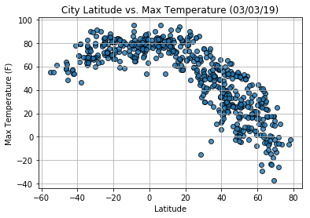
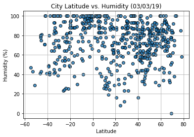
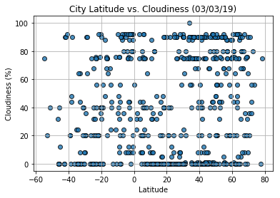
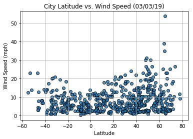

# WeatherPy
----

### Analysis
* As expected, the weather becomes significantly warmer as one approaches the equator (0 Deg. Latitude). More interestingly, however, is the fact that the southern hemisphere tends to be warmer this time of year than the northern hemisphere. This may be due to the tilt of the earth.
* There is no strong relationship between latitude and cloudiness. However, it is interesting to see that a strong band of cities sits at 0, 80, and 100% cloudiness.
* There is no strong relationship between latitude and wind speed. However, in northern hemispheres there is a flurry of cities with over 20 mph of wind.


```python
# Dependencies and Setup
import matplotlib.pyplot as plt
import pandas as pd
import numpy as np
import requests
import time

# Import API key
from api_keys import api_key

# Incorporated citipy to determine city based on latitude and longitude
from citipy import citipy

# Output File (CSV)
output_data_file = "output_data/cities.csv"

# Range of latitudes and longitudes
lat_range = (-90, 90)
lng_range = (-180, 180)
```

## Generate Cities List


```python
# List for holding lat_lngs and cities
lat_lngs = []
cities = []

# Create a set of random lat and lng combinations
lats = np.random.uniform(low=-90.000, high=90.000, size=1500)
lngs = np.random.uniform(low=-180.000, high=180.000, size=1500)
lat_lngs = zip(lats, lngs)

# Identify nearest city for each lat, lng combination
for lat_lng in lat_lngs:
    city = citipy.nearest_city(lat_lng[0], lat_lng[1]).city_name
    
    # If the city is unique, then add it to a our cities list
    if city not in cities:
        cities.append(city)

# Print the city count to confirm sufficient count
len(cities)
```


    617


### Perform API Calls
* Perform a weather check on each city using a series of successive API calls.
* Include a print log of each city as it'sbeing processed (with the city number and city name).


```python
# Starting URL for Weather Map API Call
url = "http://api.openweathermap.org/data/2.5/weather?units=imperial&APPID=" + api_key 

# List of city data
city_data = []

# Print to logger
print("Beginning Data Retrieval     ")
print("-----------------------------")

# Create counters
record_count = 1
set_count = 1

# Loop through all the cities in list
for i, city in enumerate(cities):
        
    # Group cities in sets of 50 for logging purposes
    if (i % 50 == 0 and i >= 50):
        set_count += 1
        record_count = 0

    # Assemble url and make API request for each city
    city_url = url + "&q=" + city.replace(' ','+')

    # Extract results
    print(f"Processing Record {record_count} of Set {set_count} | {city}")

    # Add 1 to the record count
    record_count += 1

    try:
        city_weather = requests.get(city_url).json()
        city_lat = city_weather["coord"]["lat"]
        city_lng = city_weather["coord"]["lon"]
        city_max_temp = city_weather["main"]["temp_max"]
        city_humidity = city_weather["main"]["humidity"]
        city_clouds = city_weather["clouds"]["all"]
        city_wind = city_weather["wind"]["speed"]
        city_country = city_weather["sys"]["country"]
        city_date = city_weather["dt"]

        # Append the City information into city_data list
        city_data.append({"City": city, 
                          "Lat": city_lat, 
                          "Lng": city_lng, 
                          "Max Temp": city_max_temp,
                          "Humidity": city_humidity,
                          "Cloudiness": city_clouds,
                          "Wind Speed": city_wind,
                          "Country": city_country,
                          "Date": city_date})

    # If an error is experienced, skip the city
    except:
        print("City not found. Skipping...")
        pass
            
print('-----------------------------')
print('Data Retrieval Complete')
print('-----------------------------')
```

    Beginning Data Retrieval     
    -----------------------------
    Processing Record 1 of Set 1 | busselton
    Processing Record 2 of Set 1 | yellowknife
    Processing Record 3 of Set 1 | cape town
    Processing Record 4 of Set 1 | albany
    Processing Record 5 of Set 1 | san patricio
    Processing Record 6 of Set 1 | new norfolk
    Processing Record 7 of Set 1 | amahai
    Processing Record 8 of Set 1 | tabou
    Processing Record 9 of Set 1 | jamestown
    Processing Record 10 of Set 1 | kapaa
    Processing Record 11 of Set 1 | kaitangata
    Processing Record 12 of Set 1 | xacmaz
    Processing Record 13 of Set 1 | nikolskoye
    Processing Record 14 of Set 1 | rikitea
    Processing Record 15 of Set 1 | barentsburg
    City not found. Skipping...
    Processing Record 16 of Set 1 | tuktoyaktuk
    Processing Record 17 of Set 1 | mogadishu
    Processing Record 18 of Set 1 | ahipara
    Processing Record 19 of Set 1 | portland
    Processing Record 20 of Set 1 | barrow
    Processing Record 21 of Set 1 | castro
    Processing Record 22 of Set 1 | davidson
    Processing Record 23 of Set 1 | mahebourg
    Processing Record 24 of Set 1 | hofn
    Processing Record 25 of Set 1 | alofi
    Processing Record 26 of Set 1 | mayumba
    Processing Record 27 of Set 1 | hilo
    Processing Record 28 of Set 1 | vaini
    Processing Record 29 of Set 1 | chuy
    Processing Record 30 of Set 1 | hatillo
    Processing Record 31 of Set 1 | georgetown
    Processing Record 32 of Set 1 | ushuaia
    Processing Record 33 of Set 1 | fairbanks
    Processing Record 34 of Set 1 | thompson
    Processing Record 35 of Set 1 | punta arenas
    Processing Record 36 of Set 1 | carnarvon
    Processing Record 37 of Set 1 | laguna
    Processing Record 38 of Set 1 | pontianak
    Processing Record 39 of Set 1 | bredasdorp
    Processing Record 40 of Set 1 | hobyo
    Processing Record 41 of Set 1 | bengkulu
    City not found. Skipping...
    Processing Record 42 of Set 1 | lebu
    Processing Record 43 of Set 1 | vestmannaeyjar
    Processing Record 44 of Set 1 | inirida
    Processing Record 45 of Set 1 | dikson
    Processing Record 46 of Set 1 | chokurdakh
    Processing Record 47 of Set 1 | fershampenuaz
    Processing Record 48 of Set 1 | clyde river
    Processing Record 49 of Set 1 | cidreira
    Processing Record 50 of Set 1 | airai
    Processing Record 0 of Set 2 | avera
    Processing Record 1 of Set 2 | mataura
    Processing Record 2 of Set 2 | guaraniacu
    Processing Record 3 of Set 2 | amuntai
    Processing Record 4 of Set 2 | hamilton
    Processing Record 5 of Set 2 | tasiilaq
    Processing Record 6 of Set 2 | rantepao
    Processing Record 7 of Set 2 | katsuura
    Processing Record 8 of Set 2 | north bend
    Processing Record 9 of Set 2 | saskylakh
    Processing Record 10 of Set 2 | half moon bay
    Processing Record 11 of Set 2 | cayenne
    Processing Record 12 of Set 2 | aksu
    Processing Record 13 of Set 2 | strelka
    Processing Record 14 of Set 2 | ilulissat
    Processing Record 15 of Set 2 | la ronge
    Processing Record 16 of Set 2 | zonguldak
    Processing Record 17 of Set 2 | attawapiskat
    City not found. Skipping...
    Processing Record 18 of Set 2 | bambous virieux
    Processing Record 19 of Set 2 | paamiut
    Processing Record 20 of Set 2 | san jose
    Processing Record 21 of Set 2 | mangalia
    Processing Record 22 of Set 2 | saldanha
    Processing Record 23 of Set 2 | kiunga
    Processing Record 24 of Set 2 | avarua
    Processing Record 25 of Set 2 | xiongyue
    Processing Record 26 of Set 2 | barkhan
    Processing Record 27 of Set 2 | belen
    Processing Record 28 of Set 2 | bara
    Processing Record 29 of Set 2 | atuona
    Processing Record 30 of Set 2 | brownsville
    Processing Record 31 of Set 2 | puerto ayora
    Processing Record 32 of Set 2 | road town
    Processing Record 33 of Set 2 | faya
    Processing Record 34 of Set 2 | port alfred
    Processing Record 35 of Set 2 | san sebastian
    Processing Record 36 of Set 2 | tiksi
    Processing Record 37 of Set 2 | palabuhanratu
    City not found. Skipping...
    Processing Record 38 of Set 2 | praya
    Processing Record 39 of Set 2 | marquette
    Processing Record 40 of Set 2 | lompoc
    Processing Record 41 of Set 2 | bereda
    Processing Record 42 of Set 2 | ponta do sol
    Processing Record 43 of Set 2 | chaman
    Processing Record 44 of Set 2 | requena
    Processing Record 45 of Set 2 | mar del plata
    Processing Record 46 of Set 2 | ugoofaaru
    Processing Record 47 of Set 2 | simao
    Processing Record 48 of Set 2 | whitehorse
    Processing Record 49 of Set 2 | codrington
    Processing Record 0 of Set 3 | pisco
    Processing Record 1 of Set 3 | mount vernon
    Processing Record 2 of Set 3 | illoqqortoormiut
    City not found. Skipping...
    Processing Record 3 of Set 3 | krasnoselkup
    City not found. Skipping...
    Processing Record 4 of Set 3 | deputatskiy
    Processing Record 5 of Set 3 | teacapan
    Processing Record 6 of Set 3 | acapulco
    Processing Record 7 of Set 3 | narsaq
    Processing Record 8 of Set 3 | cockburn town
    Processing Record 9 of Set 3 | smithers
    Processing Record 10 of Set 3 | srednekolymsk
    Processing Record 11 of Set 3 | east london
    Processing Record 12 of Set 3 | pevek
    Processing Record 13 of Set 3 | necochea
    Processing Record 14 of Set 3 | vardo
    Processing Record 15 of Set 3 | bur gabo
    City not found. Skipping...
    Processing Record 16 of Set 3 | khorixas
    Processing Record 17 of Set 3 | sayaxche
    Processing Record 18 of Set 3 | salalah
    Processing Record 19 of Set 3 | port elizabeth
    Processing Record 20 of Set 3 | scarborough
    Processing Record 21 of Set 3 | longyearbyen
    Processing Record 22 of Set 3 | huanren
    Processing Record 23 of Set 3 | kahului
    Processing Record 24 of Set 3 | port lincoln
    Processing Record 25 of Set 3 | ambagarh chauki
    Processing Record 26 of Set 3 | esperance
    Processing Record 27 of Set 3 | barawe
    City not found. Skipping...
    Processing Record 28 of Set 3 | tutoia
    Processing Record 29 of Set 3 | sorong
    Processing Record 30 of Set 3 | ampanihy
    Processing Record 31 of Set 3 | norman wells
    Processing Record 32 of Set 3 | ostrovnoy
    Processing Record 33 of Set 3 | nianzishan
    Processing Record 34 of Set 3 | talnakh
    Processing Record 35 of Set 3 | provideniya
    Processing Record 36 of Set 3 | klyuchi
    Processing Record 37 of Set 3 | staryy nadym
    Processing Record 38 of Set 3 | viligili
    City not found. Skipping...
    Processing Record 39 of Set 3 | muhos
    Processing Record 40 of Set 3 | seoul
    Processing Record 41 of Set 3 | impfondo
    Processing Record 42 of Set 3 | hobart
    Processing Record 43 of Set 3 | lorengau
    Processing Record 44 of Set 3 | kodiak
    Processing Record 45 of Set 3 | aklavik
    Processing Record 46 of Set 3 | touros
    Processing Record 47 of Set 3 | quimper
    Processing Record 48 of Set 3 | itarema
    Processing Record 49 of Set 3 | destin
    Processing Record 0 of Set 4 | cirpan
    City not found. Skipping...
    Processing Record 1 of Set 4 | ewa beach
    Processing Record 2 of Set 4 | tunduru
    City not found. Skipping...
    Processing Record 3 of Set 4 | charters towers
    Processing Record 4 of Set 4 | hithadhoo
    Processing Record 5 of Set 4 | broome
    Processing Record 6 of Set 4 | sidney
    Processing Record 7 of Set 4 | bluff
    Processing Record 8 of Set 4 | ballater
    Processing Record 9 of Set 4 | lagos
    Processing Record 10 of Set 4 | san policarpo
    Processing Record 11 of Set 4 | mount gambier
    Processing Record 12 of Set 4 | arraial do cabo
    Processing Record 13 of Set 4 | poum
    Processing Record 14 of Set 4 | butaritari
    Processing Record 15 of Set 4 | jiroft
    City not found. Skipping...
    Processing Record 16 of Set 4 | qasigiannguit
    Processing Record 17 of Set 4 | tsabong
    Processing Record 18 of Set 4 | chumikan
    Processing Record 19 of Set 4 | saint anthony
    Processing Record 20 of Set 4 | abu dhabi
    Processing Record 21 of Set 4 | ocampo
    Processing Record 22 of Set 4 | caohai
    Processing Record 23 of Set 4 | matamoros
    Processing Record 24 of Set 4 | malanje
    Processing Record 25 of Set 4 | alugan
    Processing Record 26 of Set 4 | souillac
    Processing Record 27 of Set 4 | sandhaven
    City not found. Skipping...
    Processing Record 28 of Set 4 | maceio
    Processing Record 29 of Set 4 | chernyshevskiy
    Processing Record 30 of Set 4 | aleksandrov gay
    Processing Record 31 of Set 4 | belushya guba
    City not found. Skipping...
    Processing Record 32 of Set 4 | petropavlovsk-kamchatskiy
    Processing Record 33 of Set 4 | tsihombe
    City not found. Skipping...
    Processing Record 34 of Set 4 | khatanga
    Processing Record 35 of Set 4 | salym
    Processing Record 36 of Set 4 | saint george
    Processing Record 37 of Set 4 | moyale
    Processing Record 38 of Set 4 | qaanaaq
    Processing Record 39 of Set 4 | tezu
    Processing Record 40 of Set 4 | senovo
    Processing Record 41 of Set 4 | lokhvytsya
    Processing Record 42 of Set 4 | vila velha
    Processing Record 43 of Set 4 | torbay
    Processing Record 44 of Set 4 | saint-philippe
    Processing Record 45 of Set 4 | gogrial
    City not found. Skipping...
    Processing Record 46 of Set 4 | gushikawa
    Processing Record 47 of Set 4 | rawannawi
    City not found. Skipping...
    Processing Record 48 of Set 4 | altay
    Processing Record 49 of Set 4 | teluk nibung
    City not found. Skipping...
    Processing Record 0 of Set 5 | akropong
    Processing Record 1 of Set 5 | iqaluit
    Processing Record 2 of Set 5 | kavieng
    Processing Record 3 of Set 5 | ripoll
    Processing Record 4 of Set 5 | zabol
    Processing Record 5 of Set 5 | ko samui
    Processing Record 6 of Set 5 | gisborne
    Processing Record 7 of Set 5 | sao filipe
    Processing Record 8 of Set 5 | port hedland
    Processing Record 9 of Set 5 | tirumullaivasal
    Processing Record 10 of Set 5 | qandahar
    City not found. Skipping...
    Processing Record 11 of Set 5 | polunochnoye
    Processing Record 12 of Set 5 | jiddah
    City not found. Skipping...
    Processing Record 13 of Set 5 | el alto
    Processing Record 14 of Set 5 | zhanaozen
    Processing Record 15 of Set 5 | erzin
    Processing Record 16 of Set 5 | zachagansk
    City not found. Skipping...
    Processing Record 17 of Set 5 | samusu
    City not found. Skipping...
    Processing Record 18 of Set 5 | chapais
    Processing Record 19 of Set 5 | hovd
    Processing Record 20 of Set 5 | mys shmidta
    City not found. Skipping...
    Processing Record 21 of Set 5 | buxton
    Processing Record 22 of Set 5 | padilla
    Processing Record 23 of Set 5 | shupiyan
    Processing Record 24 of Set 5 | hermanus
    Processing Record 25 of Set 5 | ancud
    Processing Record 26 of Set 5 | komsomolskiy
    Processing Record 27 of Set 5 | tehachapi
    Processing Record 28 of Set 5 | kelvington
    Processing Record 29 of Set 5 | bethel
    Processing Record 30 of Set 5 | ribeira grande
    Processing Record 31 of Set 5 | okhotsk
    Processing Record 32 of Set 5 | taolanaro
    City not found. Skipping...
    Processing Record 33 of Set 5 | cabedelo
    Processing Record 34 of Set 5 | falesti
    Processing Record 35 of Set 5 | pitanga
    Processing Record 36 of Set 5 | nouakchott
    Processing Record 37 of Set 5 | reserva
    Processing Record 38 of Set 5 | fountain hills
    Processing Record 39 of Set 5 | vila franca do campo
    Processing Record 40 of Set 5 | kortkeros
    Processing Record 41 of Set 5 | kungurtug
    Processing Record 42 of Set 5 | lagoa
    Processing Record 43 of Set 5 | paralimni
    Processing Record 44 of Set 5 | dingle
    Processing Record 45 of Set 5 | dalbandin
    Processing Record 46 of Set 5 | buraydah
    Processing Record 47 of Set 5 | tabuk
    Processing Record 48 of Set 5 | nome
    Processing Record 49 of Set 5 | masuguru
    Processing Record 0 of Set 6 | cabo san lucas
    Processing Record 1 of Set 6 | chase
    Processing Record 2 of Set 6 | shasta lake
    Processing Record 3 of Set 6 | wells
    Processing Record 4 of Set 6 | novoagansk
    Processing Record 5 of Set 6 | amderma
    City not found. Skipping...
    Processing Record 6 of Set 6 | vila
    Processing Record 7 of Set 6 | walvis bay
    Processing Record 8 of Set 6 | matara
    Processing Record 9 of Set 6 | palmer
    Processing Record 10 of Set 6 | fukuma
    Processing Record 11 of Set 6 | sao joao da barra
    Processing Record 12 of Set 6 | tuggurt
    City not found. Skipping...
    Processing Record 13 of Set 6 | auki
    Processing Record 14 of Set 6 | lokosovo
    Processing Record 15 of Set 6 | anadyr
    Processing Record 16 of Set 6 | pangai
    Processing Record 17 of Set 6 | campbellton
    Processing Record 18 of Set 6 | zhezkazgan
    Processing Record 19 of Set 6 | mehamn
    Processing Record 20 of Set 6 | stephenville
    Processing Record 21 of Set 6 | manggar
    Processing Record 22 of Set 6 | cururupu
    Processing Record 23 of Set 6 | magadan
    Processing Record 24 of Set 6 | severo-kurilsk
    Processing Record 25 of Set 6 | victoria
    Processing Record 26 of Set 6 | asau
    City not found. Skipping...
    Processing Record 27 of Set 6 | jefferson city
    Processing Record 28 of Set 6 | susehri
    Processing Record 29 of Set 6 | ghanzi
    Processing Record 30 of Set 6 | aksarka
    Processing Record 31 of Set 6 | cap malheureux
    Processing Record 32 of Set 6 | caravelas
    Processing Record 33 of Set 6 | maneadero
    City not found. Skipping...
    Processing Record 34 of Set 6 | college
    Processing Record 35 of Set 6 | kashi
    City not found. Skipping...
    Processing Record 36 of Set 6 | tumannyy
    City not found. Skipping...
    Processing Record 37 of Set 6 | fortuna
    Processing Record 38 of Set 6 | san quintin
    Processing Record 39 of Set 6 | yvetot
    Processing Record 40 of Set 6 | lolua
    City not found. Skipping...
    Processing Record 41 of Set 6 | puerto narino
    Processing Record 42 of Set 6 | hami
    Processing Record 43 of Set 6 | khonuu
    City not found. Skipping...
    Processing Record 44 of Set 6 | san rafael
    Processing Record 45 of Set 6 | upernavik
    Processing Record 46 of Set 6 | saint-georges
    Processing Record 47 of Set 6 | cherskiy
    Processing Record 48 of Set 6 | cumana
    Processing Record 49 of Set 6 | yelnya
    Processing Record 0 of Set 7 | galesong
    Processing Record 1 of Set 7 | oktyabrskoye
    Processing Record 2 of Set 7 | ponta delgada
    Processing Record 3 of Set 7 | puteyets
    Processing Record 4 of Set 7 | parsabad
    Processing Record 5 of Set 7 | douglas
    Processing Record 6 of Set 7 | nizhneyansk
    City not found. Skipping...
    Processing Record 7 of Set 7 | azimur
    City not found. Skipping...
    Processing Record 8 of Set 7 | geraldton
    Processing Record 9 of Set 7 | naze
    Processing Record 10 of Set 7 | mayo
    Processing Record 11 of Set 7 | manjacaze
    Processing Record 12 of Set 7 | slave lake
    Processing Record 13 of Set 7 | batagay-alyta
    Processing Record 14 of Set 7 | sur
    Processing Record 15 of Set 7 | wang saphung
    Processing Record 16 of Set 7 | pangnirtung
    Processing Record 17 of Set 7 | humaita
    Processing Record 18 of Set 7 | uribia
    Processing Record 19 of Set 7 | taltal
    Processing Record 20 of Set 7 | byron bay
    Processing Record 21 of Set 7 | warrington
    Processing Record 22 of Set 7 | slavyanka
    Processing Record 23 of Set 7 | leningradskiy
    Processing Record 24 of Set 7 | chimbote
    Processing Record 25 of Set 7 | gumdag
    Processing Record 26 of Set 7 | yar-sale
    Processing Record 27 of Set 7 | zhangye
    Processing Record 28 of Set 7 | asfi
    City not found. Skipping...
    Processing Record 29 of Set 7 | nishihara
    Processing Record 30 of Set 7 | klaksvik
    Processing Record 31 of Set 7 | ozgon
    City not found. Skipping...
    Processing Record 32 of Set 7 | ukiah
    Processing Record 33 of Set 7 | svetlyy
    City not found. Skipping...
    Processing Record 34 of Set 7 | meulaboh
    Processing Record 35 of Set 7 | buala
    Processing Record 36 of Set 7 | bandiagara
    Processing Record 37 of Set 7 | dolbeau
    City not found. Skipping...
    Processing Record 38 of Set 7 | wawa
    Processing Record 39 of Set 7 | marcona
    City not found. Skipping...
    Processing Record 40 of Set 7 | beringovskiy
    Processing Record 41 of Set 7 | yairipok
    Processing Record 42 of Set 7 | vaitupu
    City not found. Skipping...
    Processing Record 43 of Set 7 | kruisfontein
    Processing Record 44 of Set 7 | meinung
    City not found. Skipping...
    Processing Record 45 of Set 7 | porto novo
    Processing Record 46 of Set 7 | ishigaki
    Processing Record 47 of Set 7 | hidalgo
    Processing Record 48 of Set 7 | talcahuano
    Processing Record 49 of Set 7 | luderitz
    Processing Record 0 of Set 8 | grand river south east
    City not found. Skipping...
    Processing Record 1 of Set 8 | santa maria
    Processing Record 2 of Set 8 | massakory
    Processing Record 3 of Set 8 | tiznit
    Processing Record 4 of Set 8 | saint-joseph
    Processing Record 5 of Set 8 | te anau
    Processing Record 6 of Set 8 | los llanos de aridane
    Processing Record 7 of Set 8 | pimentel
    Processing Record 8 of Set 8 | bud
    Processing Record 9 of Set 8 | aranda de duero
    Processing Record 10 of Set 8 | angoram
    Processing Record 11 of Set 8 | dunedin
    Processing Record 12 of Set 8 | phan rang
    City not found. Skipping...
    Processing Record 13 of Set 8 | nanortalik
    Processing Record 14 of Set 8 | saint-pierre
    Processing Record 15 of Set 8 | emerald
    Processing Record 16 of Set 8 | tuatapere
    Processing Record 17 of Set 8 | genhe
    Processing Record 18 of Set 8 | san luis
    Processing Record 19 of Set 8 | manta
    Processing Record 20 of Set 8 | adrar
    Processing Record 21 of Set 8 | flinders
    Processing Record 22 of Set 8 | mattru
    Processing Record 23 of Set 8 | la libertad
    Processing Record 24 of Set 8 | villarrica
    Processing Record 25 of Set 8 | biak
    Processing Record 26 of Set 8 | coihaique
    Processing Record 27 of Set 8 | safaga
    City not found. Skipping...
    Processing Record 28 of Set 8 | zinder
    Processing Record 29 of Set 8 | arona
    Processing Record 30 of Set 8 | ruwi
    Processing Record 31 of Set 8 | layou
    City not found. Skipping...
    Processing Record 32 of Set 8 | huilong
    Processing Record 33 of Set 8 | coquimbo
    Processing Record 34 of Set 8 | umm durman
    City not found. Skipping...
    Processing Record 35 of Set 8 | sundsvall
    Processing Record 36 of Set 8 | gat
    Processing Record 37 of Set 8 | hambantota
    Processing Record 38 of Set 8 | nouadhibou
    Processing Record 39 of Set 8 | bar harbor
    Processing Record 40 of Set 8 | juneau
    Processing Record 41 of Set 8 | tommot
    Processing Record 42 of Set 8 | ocean city
    Processing Record 43 of Set 8 | tomball
    Processing Record 44 of Set 8 | toppenish
    Processing Record 45 of Set 8 | gunjur
    Processing Record 46 of Set 8 | jutai
    Processing Record 47 of Set 8 | port hardy
    Processing Record 48 of Set 8 | yeppoon
    Processing Record 49 of Set 8 | salamiyah
    Processing Record 0 of Set 9 | guerrero negro
    Processing Record 1 of Set 9 | chake chake
    Processing Record 2 of Set 9 | mahibadhoo
    Processing Record 3 of Set 9 | palmeiras de goias
    Processing Record 4 of Set 9 | the valley
    Processing Record 5 of Set 9 | humberto de campos
    Processing Record 6 of Set 9 | manadhoo
    Processing Record 7 of Set 9 | pingliang
    Processing Record 8 of Set 9 | elizabeth city
    Processing Record 9 of Set 9 | tura
    Processing Record 10 of Set 9 | daru
    Processing Record 11 of Set 9 | lajas
    Processing Record 12 of Set 9 | mildura
    Processing Record 13 of Set 9 | lasa
    Processing Record 14 of Set 9 | la palma
    Processing Record 15 of Set 9 | geresk
    City not found. Skipping...
    Processing Record 16 of Set 9 | kawalu
    Processing Record 17 of Set 9 | banjar
    Processing Record 18 of Set 9 | ngukurr
    City not found. Skipping...
    Processing Record 19 of Set 9 | rungata
    City not found. Skipping...
    Processing Record 20 of Set 9 | puerto carreno
    Processing Record 21 of Set 9 | husavik
    Processing Record 22 of Set 9 | luau
    Processing Record 23 of Set 9 | varzea da palma
    Processing Record 24 of Set 9 | azanka
    Processing Record 25 of Set 9 | itoman
    Processing Record 26 of Set 9 | muskegon
    Processing Record 27 of Set 9 | makinsk
    Processing Record 28 of Set 9 | curaca
    Processing Record 29 of Set 9 | porto franco
    Processing Record 30 of Set 9 | faanui
    Processing Record 31 of Set 9 | saleaula
    City not found. Skipping...
    Processing Record 32 of Set 9 | sogdiondon
    City not found. Skipping...
    Processing Record 33 of Set 9 | iseyin
    Processing Record 34 of Set 9 | kedrovyy
    Processing Record 35 of Set 9 | saint-donat-de-montcalm
    Processing Record 36 of Set 9 | saint-augustin
    Processing Record 37 of Set 9 | pacific grove
    Processing Record 38 of Set 9 | tumpat
    Processing Record 39 of Set 9 | igarka
    Processing Record 40 of Set 9 | manoel urbano
    Processing Record 41 of Set 9 | maragogi
    Processing Record 42 of Set 9 | vao
    Processing Record 43 of Set 9 | ayan
    Processing Record 44 of Set 9 | isangel
    Processing Record 45 of Set 9 | jiayuguan
    Processing Record 46 of Set 9 | ketchikan
    Processing Record 47 of Set 9 | merauke
    Processing Record 48 of Set 9 | tsumeb
    Processing Record 49 of Set 9 | elko
    Processing Record 0 of Set 10 | zhigansk
    Processing Record 1 of Set 10 | ginda
    Processing Record 2 of Set 10 | pathein
    Processing Record 3 of Set 10 | kutum
    Processing Record 4 of Set 10 | khandyga
    Processing Record 5 of Set 10 | nelson bay
    Processing Record 6 of Set 10 | manzil salim
    Processing Record 7 of Set 10 | goderich
    Processing Record 8 of Set 10 | shingu
    Processing Record 9 of Set 10 | padang
    Processing Record 10 of Set 10 | staraya poltavka
    Processing Record 11 of Set 10 | cairns
    Processing Record 12 of Set 10 | bulgan
    Processing Record 13 of Set 10 | marfino
    Processing Record 14 of Set 10 | sambava
    Processing Record 15 of Set 10 | kitob
    Processing Record 16 of Set 10 | conway
    Processing Record 17 of Set 10 | amantea
    Processing Record 18 of Set 10 | astoria
    Processing Record 19 of Set 10 | muroto
    Processing Record 20 of Set 10 | kempsey
    Processing Record 21 of Set 10 | at-bashi
    Processing Record 22 of Set 10 | brewster
    Processing Record 23 of Set 10 | basqal
    Processing Record 24 of Set 10 | araouane
    Processing Record 25 of Set 10 | vauvert
    Processing Record 26 of Set 10 | antofagasta
    Processing Record 27 of Set 10 | churapcha
    Processing Record 28 of Set 10 | onokhino
    Processing Record 29 of Set 10 | young
    Processing Record 30 of Set 10 | vidim
    Processing Record 31 of Set 10 | namatanai
    Processing Record 32 of Set 10 | constitucion
    Processing Record 33 of Set 10 | alice springs
    Processing Record 34 of Set 10 | abha
    Processing Record 35 of Set 10 | kuche
    City not found. Skipping...
    Processing Record 36 of Set 10 | kyshtovka
    Processing Record 37 of Set 10 | lahad datu
    Processing Record 38 of Set 10 | kapuskasing
    Processing Record 39 of Set 10 | kurtamysh
    Processing Record 40 of Set 10 | sovetskiy
    Processing Record 41 of Set 10 | coro
    Processing Record 42 of Set 10 | bijie
    Processing Record 43 of Set 10 | mvuma
    Processing Record 44 of Set 10 | llanes
    Processing Record 45 of Set 10 | nekhayevskiy
    Processing Record 46 of Set 10 | maputo
    Processing Record 47 of Set 10 | bubaque
    Processing Record 48 of Set 10 | kamaishi
    Processing Record 49 of Set 10 | havre
    Processing Record 0 of Set 11 | turtkul
    City not found. Skipping...
    Processing Record 1 of Set 11 | hasaki
    Processing Record 2 of Set 11 | oranjemund
    Processing Record 3 of Set 11 | olafsvik
    City not found. Skipping...
    Processing Record 4 of Set 11 | xichang
    Processing Record 5 of Set 11 | mabaruma
    Processing Record 6 of Set 11 | mongo
    Processing Record 7 of Set 11 | pochutla
    Processing Record 8 of Set 11 | xiamen
    Processing Record 9 of Set 11 | kokkola
    Processing Record 10 of Set 11 | tasbuget
    City not found. Skipping...
    Processing Record 11 of Set 11 | sassandra
    Processing Record 12 of Set 11 | harper
    Processing Record 13 of Set 11 | dukat
    Processing Record 14 of Set 11 | sfantu gheorghe
    Processing Record 15 of Set 11 | kaili
    Processing Record 16 of Set 11 | barnala
    Processing Record 17 of Set 11 | obertyn
    Processing Record 18 of Set 11 | high level
    Processing Record 19 of Set 11 | finschhafen
    Processing Record 20 of Set 11 | matay
    Processing Record 21 of Set 11 | sloboda
    Processing Record 22 of Set 11 | zastron
    Processing Record 23 of Set 11 | palu
    Processing Record 24 of Set 11 | sumbawanga
    Processing Record 25 of Set 11 | kolomak
    Processing Record 26 of Set 11 | daugai
    Processing Record 27 of Set 11 | mirnyy
    Processing Record 28 of Set 11 | biu
    Processing Record 29 of Set 11 | bokspits
    City not found. Skipping...
    Processing Record 30 of Set 11 | chimoio
    Processing Record 31 of Set 11 | rexburg
    Processing Record 32 of Set 11 | lucapa
    Processing Record 33 of Set 11 | irbil
    City not found. Skipping...
    Processing Record 34 of Set 11 | sitka
    Processing Record 35 of Set 11 | la rioja
    Processing Record 36 of Set 11 | sentyabrskiy
    City not found. Skipping...
    Processing Record 37 of Set 11 | poyarkovo
    Processing Record 38 of Set 11 | haldibari
    Processing Record 39 of Set 11 | gamba
    Processing Record 40 of Set 11 | isla mujeres
    Processing Record 41 of Set 11 | leh
    Processing Record 42 of Set 11 | brae
    Processing Record 43 of Set 11 | tugulym
    Processing Record 44 of Set 11 | antalaha
    Processing Record 45 of Set 11 | nador
    Processing Record 46 of Set 11 | swan river
    Processing Record 47 of Set 11 | ulaangom
    Processing Record 48 of Set 11 | morlaix
    Processing Record 49 of Set 11 | sarka ghat
    Processing Record 0 of Set 12 | thunder bay
    Processing Record 1 of Set 12 | cartagena del chaira
    Processing Record 2 of Set 12 | biggar
    Processing Record 3 of Set 12 | marrakesh
    Processing Record 4 of Set 12 | viedma
    Processing Record 5 of Set 12 | hualmay
    Processing Record 6 of Set 12 | la asuncion
    Processing Record 7 of Set 12 | noumea
    Processing Record 8 of Set 12 | nyurba
    Processing Record 9 of Set 12 | zarubino
    Processing Record 10 of Set 12 | meyungs
    City not found. Skipping...
    Processing Record 11 of Set 12 | puerto madero
    Processing Record 12 of Set 12 | lata
    Processing Record 13 of Set 12 | qaqortoq
    Processing Record 14 of Set 12 | phangnga
    Processing Record 15 of Set 12 | cabo rojo
    Processing Record 16 of Set 12 | garm
    City not found. Skipping...
    Processing Record 17 of Set 12 | bargal
    City not found. Skipping...
    Processing Record 18 of Set 12 | atar
    Processing Record 19 of Set 12 | rio gallegos
    Processing Record 20 of Set 12 | ruatoria
    City not found. Skipping...
    Processing Record 21 of Set 12 | loncoche
    Processing Record 22 of Set 12 | huarmey
    Processing Record 23 of Set 12 | usinsk
    Processing Record 24 of Set 12 | mount isa
    Processing Record 25 of Set 12 | tuburan
    Processing Record 26 of Set 12 | romny
    Processing Record 27 of Set 12 | celestun
    Processing Record 28 of Set 12 | port macquarie
    Processing Record 29 of Set 12 | fare
    Processing Record 30 of Set 12 | ajdabiya
    Processing Record 31 of Set 12 | port keats
    Processing Record 32 of Set 12 | stromness
    Processing Record 33 of Set 12 | volosovo
    Processing Record 34 of Set 12 | shieli
    Processing Record 35 of Set 12 | peniche
    Processing Record 36 of Set 12 | barra do garcas
    Processing Record 37 of Set 12 | matai
    Processing Record 38 of Set 12 | atherton
    Processing Record 39 of Set 12 | maniitsoq
    Processing Record 40 of Set 12 | valparaiso
    Processing Record 41 of Set 12 | olinda
    Processing Record 42 of Set 12 | kavaratti
    Processing Record 43 of Set 12 | campo verde
    Processing Record 44 of Set 12 | karratha
    Processing Record 45 of Set 12 | nguiu
    City not found. Skipping...
    Processing Record 46 of Set 12 | villa carlos paz
    Processing Record 47 of Set 12 | yulara
    Processing Record 48 of Set 12 | plouzane
    Processing Record 49 of Set 12 | banikoara
    Processing Record 0 of Set 13 | bodmin
    Processing Record 1 of Set 13 | portmore
    Processing Record 2 of Set 13 | tyrma
    Processing Record 3 of Set 13 | minab
    Processing Record 4 of Set 13 | mastung
    Processing Record 5 of Set 13 | cabra
    Processing Record 6 of Set 13 | palmares do sul
    Processing Record 7 of Set 13 | halalo
    City not found. Skipping...
    Processing Record 8 of Set 13 | kuliyapitiya
    Processing Record 9 of Set 13 | kamenskoye
    City not found. Skipping...
    Processing Record 10 of Set 13 | rocha
    Processing Record 11 of Set 13 | lapua
    Processing Record 12 of Set 13 | huntington
    Processing Record 13 of Set 13 | nizhneudinsk
    Processing Record 14 of Set 13 | kieta
    Processing Record 15 of Set 13 | tecoanapa
    Processing Record 16 of Set 13 | ambilobe
    -----------------------------
    Data Retrieval Complete
    -----------------------------
    

### Convert Raw Data to DataFrame
* Export the city data into a .csv.
* Display the DataFrame


```python
# Convert array of JSON into Pandas DataFrame
city_data_pd = pd.DataFrame(city_data)

# Export the City_Data into a csv
city_data_pd.to_csv(output_data_file, index_label="Index")

# Show Record Count
city_data_pd.count()
```


    City          552
    Cloudiness    552
    Country       552
    Date          552
    Humidity      552
    Lat           552
    Lng           552
    Max Temp      552
    Wind Speed    552
    dtype: int64


```python
# Display the City Data Frame
city_data_pd.head()
```


<div>
<style scoped>
    .dataframe tbody tr th:only-of-type {
        vertical-align: middle;
    }

    .dataframe tbody tr th {
        vertical-align: top;
    }

    .dataframe thead th {
        text-align: right;
    }
</style>
<table border="1" class="dataframe">
  <thead>
    <tr style="text-align: right;">
      <th></th>
      <th>City</th>
      <th>Cloudiness</th>
      <th>Country</th>
      <th>Date</th>
      <th>Humidity</th>
      <th>Lat</th>
      <th>Lng</th>
      <th>Max Temp</th>
      <th>Wind Speed</th>
    </tr>
  </thead>
  <tbody>
    <tr>
      <th>0</th>
      <td>busselton</td>
      <td>0</td>
      <td>AU</td>
      <td>1551647111</td>
      <td>42</td>
      <td>-33.64</td>
      <td>115.35</td>
      <td>64.99</td>
      <td>19.95</td>
    </tr>
    <tr>
      <th>1</th>
      <td>yellowknife</td>
      <td>20</td>
      <td>CA</td>
      <td>1551647086</td>
      <td>42</td>
      <td>62.45</td>
      <td>-114.38</td>
      <td>10.00</td>
      <td>4.70</td>
    </tr>
    <tr>
      <th>2</th>
      <td>cape town</td>
      <td>0</td>
      <td>ZA</td>
      <td>1551647176</td>
      <td>93</td>
      <td>-33.93</td>
      <td>18.42</td>
      <td>68.00</td>
      <td>4.70</td>
    </tr>
    <tr>
      <th>3</th>
      <td>albany</td>
      <td>75</td>
      <td>US</td>
      <td>1551647225</td>
      <td>44</td>
      <td>42.65</td>
      <td>-73.75</td>
      <td>39.99</td>
      <td>4.70</td>
    </tr>
    <tr>
      <th>4</th>
      <td>san patricio</td>
      <td>0</td>
      <td>PY</td>
      <td>1551647029</td>
      <td>54</td>
      <td>-26.98</td>
      <td>-56.83</td>
      <td>89.86</td>
      <td>2.51</td>
    </tr>
  </tbody>
</table>
</div>


### Plotting the Data
* Use proper labeling of the plots using plot titles (including date of analysis) and axes labels.
* Save the plotted figures as .pngs.


```python
# Extract relevant fields from the data frame
lats = city_data_pd["Lat"]
max_temps = city_data_pd["Max Temp"]
humidity = city_data_pd["Humidity"]
cloudiness = city_data_pd["Cloudiness"]
wind_speed = city_data_pd["Wind Speed"]
today = time.strftime("%x")
```

#### Latitude vs. Temperature Plot


```python
# Build scatter plot for latitude vs temperature
plt.scatter(lats, 
            max_temps,
            edgecolor="black", linewidths=1, marker="o", 
            alpha=0.8, label="Cities")

# Incorporate the other graph properties
plt.title("City Latitude vs. Max Temperature (%s)" % today)
plt.ylabel("Max Temperature (F)")
plt.xlabel("Latitude")
plt.grid(True)

# Save the figure
plt.savefig("output_data/Fig1_Lat_vs_Temp.png")

# Show plot
plt.show()
```





#### Latitude vs. Humidity Plot


```python
# Build the scatter plots for each city types
plt.scatter(lats, 
            humidity,
            edgecolor="black", linewidths=1, marker="o", 
            alpha=0.8, label="Cities")

# Incorporate the other graph properties
plt.title("City Latitude vs. Humidity (%s)" % today)
plt.ylabel("Humidity (%)")
plt.xlabel("Latitude")
plt.grid(True)

# Save the figure
plt.savefig("output_data/Fig2_Lat_vs_Humid.png")

# Show plot
plt.show()
```





#### Latitude vs. Cloudiness Plot


```python
# Build the scatter plots for each city types
plt.scatter(lats, 
            cloudiness,
            edgecolor="black", linewidths=1, marker="o", 
            alpha=0.8, label="Cities")

# Incorporate the other graph properties
plt.title("City Latitude vs. Cloudiness (%s)" % today)
plt.ylabel("Cloudiness (%)")
plt.xlabel("Latitude")
plt.grid(True)

# Save the figure
plt.savefig("output_data/Fig3_Lat_vs_Cloud.png")

# Show plot
plt.show()
```





#### Latitude vs. Wind Speed Plot


```python
# Build the scatter plots for each city types
plt.scatter(lats, 
            wind_speed,
            edgecolor="black", linewidths=1, marker="o", 
            alpha=0.8, label="Cities")

# Incorporate the other graph properties
plt.title("City Latitude vs. Wind Speed (%s)" % today)
plt.ylabel("Wind Speed (mph)")
plt.xlabel("Latitude")
plt.grid(True)

# Save the figure
plt.savefig("output_data/Fig4_Lat_vs_Wind.png")

# Show plot
plt.show()
```




