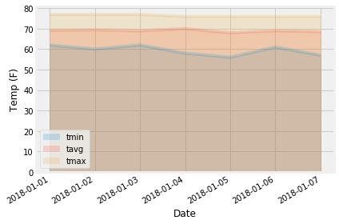

```python
%matplotlib inline
from matplotlib import style
style.use('fivethirtyeight')
import matplotlib.pyplot as plt
```


```python
import numpy as np
import pandas as pd
```


```python
import datetime as dt
```

# Reflect Tables into SQLAlchemy ORM


```python
# Python SQL toolkit and Object Relational Mapper
import sqlalchemy
from sqlalchemy.ext.automap import automap_base
from sqlalchemy.orm import Session
from sqlalchemy import create_engine, func
```


```python
engine = create_engine("sqlite:///Resources/hawaii.sqlite")
```


```python
# reflect an existing database into a new model
Base = automap_base()
# reflect the tables
Base.prepare(engine, reflect=True)
```


```python
# We can view all of the classes that automap found
Base.classes.keys()
```


    ['measurement', 'station']


```python
# Save references to each table
Measurement = Base.classes.measurement
Station = Base.classes.station
```


```python
# Create our session (link) from Python to the DB
session = Session(engine)
```


```python
# Display the row's columns and data in dictionary format for measurment class
first_row = session.query(Measurement).first()
first_row.__dict__
```


    {'_sa_instance_state': <sqlalchemy.orm.state.InstanceState at 0x254f2fb3c18>,
     'id': 1,
     'prcp': 0.08,
     'station': 'USC00519397',
     'tobs': 65.0,
     'date': '2010-01-01'}


```python
# Display the row's columns and data in dictionary format for station class
first_row = session.query(Station).first()
first_row.__dict__
```


    {'_sa_instance_state': <sqlalchemy.orm.state.InstanceState at 0x254f2fc7b38>,
     'longitude': -157.8168,
     'name': 'WAIKIKI 717.2, HI US',
     'id': 1,
     'elevation': 3.0,
     'latitude': 21.2716,
     'station': 'USC00519397'}


# Climate Analysis and Exploration
***

## Precipitation Analysis
### Design a query to retrieve the last 12 months of precipitation data and plot the results

- Calculate the date 1 year ago from the last data point in the database


```python
# Grab last date entry in the data table
last_date = session.query(Measurement.date).order_by(Measurement.date.desc()).first()[0]
print(last_date)
```

    2017-08-23
    


```python
# Grab start of last 12 months
start_date = dt.date(2017, 8, 23) - dt.timedelta(days=365)
print(start_date)
```

    2016-08-23
    

- Perform a query to retrieve the data and precipitation scores


```python
# Query to pull last 12 months of precipitation scores
prcp = session.query(Measurement.date, Measurement.prcp).\
       filter(Measurement.date >= start_date).\
       order_by(Measurement.date).all()
```

- Save the query results as a Pandas DataFrame and set the index to the date column


```python
# Load data from the query into a dataframe
prcp_df = pd.DataFrame(prcp)
prcp_df.set_index("date").head()
```


<div>
<style scoped>
    .dataframe tbody tr th:only-of-type {
        vertical-align: middle;
    }

    .dataframe tbody tr th {
        vertical-align: top;
    }

    .dataframe thead th {
        text-align: right;
    }
</style>
<table border="1" class="dataframe">
  <thead>
    <tr style="text-align: right;">
      <th></th>
      <th>prcp</th>
    </tr>
    <tr>
      <th>date</th>
      <th></th>
    </tr>
  </thead>
  <tbody>
    <tr>
      <th>2016-08-23</th>
      <td>0.00</td>
    </tr>
    <tr>
      <th>2016-08-23</th>
      <td>0.15</td>
    </tr>
    <tr>
      <th>2016-08-23</th>
      <td>0.05</td>
    </tr>
    <tr>
      <th>2016-08-23</th>
      <td>NaN</td>
    </tr>
    <tr>
      <th>2016-08-23</th>
      <td>0.02</td>
    </tr>
  </tbody>
</table>
</div>


- Sort the dataframe by date


```python
# Date sort
date = prcp_df.sort_values(by="date",ascending=False)
date.head()
```


<div>
<style scoped>
    .dataframe tbody tr th:only-of-type {
        vertical-align: middle;
    }

    .dataframe tbody tr th {
        vertical-align: top;
    }

    .dataframe thead th {
        text-align: right;
    }
</style>
<table border="1" class="dataframe">
  <thead>
    <tr style="text-align: right;">
      <th></th>
      <th>date</th>
      <th>prcp</th>
    </tr>
  </thead>
  <tbody>
    <tr>
      <th>2229</th>
      <td>2017-08-23</td>
      <td>0.45</td>
    </tr>
    <tr>
      <th>2228</th>
      <td>2017-08-23</td>
      <td>0.08</td>
    </tr>
    <tr>
      <th>2227</th>
      <td>2017-08-23</td>
      <td>0.00</td>
    </tr>
    <tr>
      <th>2226</th>
      <td>2017-08-23</td>
      <td>0.00</td>
    </tr>
    <tr>
      <th>2225</th>
      <td>2017-08-22</td>
      <td>0.50</td>
    </tr>
  </tbody>
</table>
</div>


- Use Pandas Plotting with Matplotlib to plot the data


```python
# plot the dataframe
prcp_df.plot("date", "prcp", figsize=(12,9))
plt.tick_params(axis="y", labelsize=18)
plt.xlabel("date", size=24)
plt.legend(["precipitation"], bbox_to_anchor=(.5,1), fontsize="16")
plt.tight_layout()
plt.show()
```


- Use Pandas to calcualte the summary statistics for the precipitation data


```python
prcp_df.describe()
```


<div>
<style scoped>
    .dataframe tbody tr th:only-of-type {
        vertical-align: middle;
    }

    .dataframe tbody tr th {
        vertical-align: top;
    }

    .dataframe thead th {
        text-align: right;
    }
</style>
<table border="1" class="dataframe">
  <thead>
    <tr style="text-align: right;">
      <th></th>
      <th>prcp</th>
    </tr>
  </thead>
  <tbody>
    <tr>
      <th>count</th>
      <td>2021.000000</td>
    </tr>
    <tr>
      <th>mean</th>
      <td>0.177279</td>
    </tr>
    <tr>
      <th>std</th>
      <td>0.461190</td>
    </tr>
    <tr>
      <th>min</th>
      <td>0.000000</td>
    </tr>
    <tr>
      <th>25%</th>
      <td>0.000000</td>
    </tr>
    <tr>
      <th>50%</th>
      <td>0.020000</td>
    </tr>
    <tr>
      <th>75%</th>
      <td>0.130000</td>
    </tr>
    <tr>
      <th>max</th>
      <td>6.700000</td>
    </tr>
  </tbody>
</table>
</div>


## Station Analysis

### Design a query to calculate the total number of stations


```python
# Total number of stations
session.query(func.count(Station.station)).all()
```


    [(9)]


### Design a query to find the most active stations

- List the stations and the counts in descending order


```python
# Query for stations with the most rows
station_list = session.query(Measurement.station, func.count(Measurement.station)).\
    group_by(Measurement.station).\
    order_by(func.count(Measurement.station).desc()).all()
station_list
```


    [('USC00519281', 2772),
     ('USC00519397', 2724),
     ('USC00513117', 2709),
     ('USC00519523', 2669),
     ('USC00516128', 2612),
     ('USC00514830', 2202),
     ('USC00511918', 1979),
     ('USC00517948', 1372),
     ('USC00518838', 511)]


- Calculate the lowest temperature recorded, highest temperature recorded, and average temperature for the most active station


```python
# Using the station list from the previous query for most active station
most_active = station_list[0][0]
session.query(func.min(Measurement.tobs) , func.max(Measurement.tobs), func.avg(Measurement.tobs)).\
                filter(Measurement.station == most_active).all()
```


    [(54.0, 85.0, 71.66378066378067)]


### Design a query to retrieve the last 12 months of temperature observation data (tobs)


```python
# Choose the station with the highest number of temperature observations.
# Query the last 12 months of temperature observation data for this station
temp = session.query(Measurement.station, Measurement.tobs).\
                filter(Measurement.station == most_active).\
                filter(Measurement.date >= start_date).all()
tobs_df = pd.DataFrame(temp)
tobs_df.set_index("station").head()
```


<div>
<style scoped>
    .dataframe tbody tr th:only-of-type {
        vertical-align: middle;
    }

    .dataframe tbody tr th {
        vertical-align: top;
    }

    .dataframe thead th {
        text-align: right;
    }
</style>
<table border="1" class="dataframe">
  <thead>
    <tr style="text-align: right;">
      <th></th>
      <th>tobs</th>
    </tr>
    <tr>
      <th>station</th>
      <th></th>
    </tr>
  </thead>
  <tbody>
    <tr>
      <th>USC00519281</th>
      <td>77.0</td>
    </tr>
    <tr>
      <th>USC00519281</th>
      <td>77.0</td>
    </tr>
    <tr>
      <th>USC00519281</th>
      <td>80.0</td>
    </tr>
    <tr>
      <th>USC00519281</th>
      <td>80.0</td>
    </tr>
    <tr>
      <th>USC00519281</th>
      <td>75.0</td>
    </tr>
  </tbody>
</table>
</div>


```python
# Plot the results as a histogram with bins=12
plt.hist(tobs_df["tobs"], bins=12)
plt.ylabel("Frequency")
plt.legend(["tobs"])
plt.tight_layout()
plt.show()
```


## Temperature Analysis


```python
# This function called `calc_temps` will accept start date and end date in the format '%Y-%m-%d' 
# and return the minimum, average, and maximum temperatures for that range of dates
def calc_temps(start_date, end_date):
    """TMIN, TAVG, and TMAX for a list of dates.
    
    Args:
        start_date (string): A date string in the format %Y-%m-%d
        end_date (string): A date string in the format %Y-%m-%d
        
    Returns:
        TMIN, TAVE, and TMAX
    """
    
    return session.query(func.min(Measurement.tobs), func.avg(Measurement.tobs), func.max(Measurement.tobs)).\
        filter(Measurement.date >= start_date).filter(Measurement.date <= end_date).all()

# function usage example
print(calc_temps('2012-02-28', '2012-03-05'))
```

    [(62.0, 69.57142857142857, 74.0)]
    

- Use the calc_temps function to calculate the min, avg, and max temperatures for your trip using the matching dates from the previous year


```python
# Find matching dates from the previous year
prev_year_start = dt.date(2018, 1, 1) - dt.timedelta(days=365)
prev_year_end = dt.date(2018, 1, 7) - dt.timedelta(days=365)
print(prev_year_end)
print(prev_year_start)
```

    2017-01-07
    2017-01-01
    


```python
# Calculate the tmin, tavg, and tmax for trip using previous year's data for those same dates
def calc_temps(start_date, end_date):
    
    return session.query(func.min(Measurement.tobs), func.avg(Measurement.tobs), func.max(Measurement.tobs)).\
        filter(Measurement.date >= start_date).filter(Measurement.date <= end_date).all()

print(calc_temps("2017-01-01", "2017-01-07"))
```

    [(62.0, 68.36585365853658, 74.0)]
    


```python
# load the results into individual variables
temps = calc_temps(prev_year_start,prev_year_end)
tmin, tavg, tmax = temps[0]
```

- Plot the min, avg, and max temperature from your previous query as a bar chart
    - Use the average temperature as the bar height
    - Use the peak-to-peak (tmax-tmin) value as the y error bar (yerr)


```python
# Plot previous query as a bar chart
# Use "Trip Avg Temp" as your Title
error = tmax - tmin
xpos = 1
height = tavg
plt.figure(figsize=(4,8))
plt.bar(xpos,height, yerr=error, alpha = 0.75, color = "lightsalmon")
plt.xticks([])
plt.ylabel("Temp(F)")
plt.title("Trip Avg Temp")
plt.tight_layout()
plt.xlim(0.45,1.55)
plt.ylim(0,105)
plt.show()
```


## Daily Rainfall Average

- Calculate the total amount of rainfall per weather station for your trip dates using the previous year's matching dates
    - Sort this in descending order by precipitation amount and list the station, name, latitude, longitude, and elevation


```python
# Query to calculate the total rainfall per weather station using previous year's dates &
# Sort this in descending order by precipitation amount
sel = [Station.station, Station.name, Station.latitude, Station.longitude, 
       Station.elevation, func.sum(Measurement.prcp)]

total_rainfall = session.query(*sel).filter(Measurement.station == Station.station).\
    filter(Measurement.date.between(prev_year_start,prev_year_end)).\
    group_by(Station.station).order_by(func.sum(Measurement.prcp).desc()).all()

print(total_rainfall)
```

    [('USC00519523', 'WAIMANALO EXPERIMENTAL FARM, HI US', 21.33556, -157.71139, 19.5, 0.61), ('USC00514830', 'KUALOA RANCH HEADQUARTERS 886.9, HI US', 21.5213, -157.8374, 7.0, 0.6), ('USC00516128', 'MANOA LYON ARBO 785.2, HI US', 21.3331, -157.8025, 152.4, 0.6), ('USC00513117', 'KANEOHE 838.1, HI US', 21.4234, -157.8015, 14.6, 0.35), ('USC00519281', 'WAIHEE 837.5, HI US', 21.45167, -157.84888999999998, 32.9, 0.2), ('USC00519397', 'WAIKIKI 717.2, HI US', 21.2716, -157.8168, 3.0, 0.0)]
    

- Calculate the daily normals. Normals are the averages for the min, avg, and max temperatures


```python
# Create a query that will calculate the daily normals 
# (i.e. the averages for tmin, tmax, and tavg for all historic data matching a specific month and day)

def daily_normals(date):
    """Daily Normals.
    
    Args:
        date (str): A date string in the format '%m-%d'
        
    Returns:
        A list of tuples containing the daily normals, tmin, tavg, and tmax
    
    """
    
    sel = [func.min(Measurement.tobs), func.avg(Measurement.tobs), func.max(Measurement.tobs)]
    return session.query(*sel).filter(func.strftime("%m-%d", Measurement.date) == date).all()
    
daily_normals("01-01")
```


    [(62.0, 69.15384615384616, 77.0)]


- Create a list of dates for your trip in the format %m-%d. Use the daily_normals function to calculate the normals for each date string and append the results to a list


```python
# Set the start and end date of the trip
start_trip = dt.date(2018, 1, 1)
end_trip = dt.date(2018, 1, 7)

# Use the start and end date to create a range of dates
date_range = pd.date_range(start_trip, end_trip)

# Stip off the year and save a list of %m-%d strings
date_list = [d.strftime("%m-%d") for d in date_range]

# Loop through the list of %m-%d strings and calculate the normals for each date
normal_temp = [daily_normals(d)[0] for d in date_list]
normal_temp
```


    [(62.0, 69.15384615384616, 77.0),
     (60.0, 69.39622641509433, 77.0),
     (62.0, 68.9090909090909, 77.0),
     (58.0, 70.0, 76.0),
     (56.0, 67.96428571428571, 76.0),
     (61.0, 68.96491228070175, 76.0),
     (57.0, 68.54385964912281, 76.0)]


- Load the list of daily normals into a Pandas DataFrame and set the index equal to the date


```python
# Load the previous query results into a Pandas DataFrame and add the `trip_dates` range as the `date` index
normal_temp_df = pd.DataFrame(normal_temp, columns = ["tmin","tavg","tmax"], index=date_range)
normal_temp_df.index.name = "date"
normal_temp_df
```


<div>
<style scoped>
    .dataframe tbody tr th:only-of-type {
        vertical-align: middle;
    }

    .dataframe tbody tr th {
        vertical-align: top;
    }

    .dataframe thead th {
        text-align: right;
    }
</style>
<table border="1" class="dataframe">
  <thead>
    <tr style="text-align: right;">
      <th></th>
      <th>tmin</th>
      <th>tavg</th>
      <th>tmax</th>
    </tr>
    <tr>
      <th>date</th>
      <th></th>
      <th></th>
      <th></th>
    </tr>
  </thead>
  <tbody>
    <tr>
      <th>2018-01-01</th>
      <td>62.0</td>
      <td>69.153846</td>
      <td>77.0</td>
    </tr>
    <tr>
      <th>2018-01-02</th>
      <td>60.0</td>
      <td>69.396226</td>
      <td>77.0</td>
    </tr>
    <tr>
      <th>2018-01-03</th>
      <td>62.0</td>
      <td>68.909091</td>
      <td>77.0</td>
    </tr>
    <tr>
      <th>2018-01-04</th>
      <td>58.0</td>
      <td>70.000000</td>
      <td>76.0</td>
    </tr>
    <tr>
      <th>2018-01-05</th>
      <td>56.0</td>
      <td>67.964286</td>
      <td>76.0</td>
    </tr>
    <tr>
      <th>2018-01-06</th>
      <td>61.0</td>
      <td>68.964912</td>
      <td>76.0</td>
    </tr>
    <tr>
      <th>2018-01-07</th>
      <td>57.0</td>
      <td>68.543860</td>
      <td>76.0</td>
    </tr>
  </tbody>
</table>
</div>


- Use Pandas to plot an area plot (stacked=False) for the daily normals


```python
# To Use date tick labels
import matplotlib.dates as mdates
```


```python
fig, ax = plt.subplots()
normal_temp_df.plot(kind = "area", stacked = False, alpha =0.2, ax=ax)
plt.xlabel("Date")
plt.ylabel("Temp (F)")
plt.minorticks_off()
ax.xaxis.set_ticklabels(normal_temp_df.index.date, rotation=30, ha="right")
ax.xaxis.set_major_locator(mdates.DayLocator())
plt.tight_layout()
plt.show()
```





```python

```
