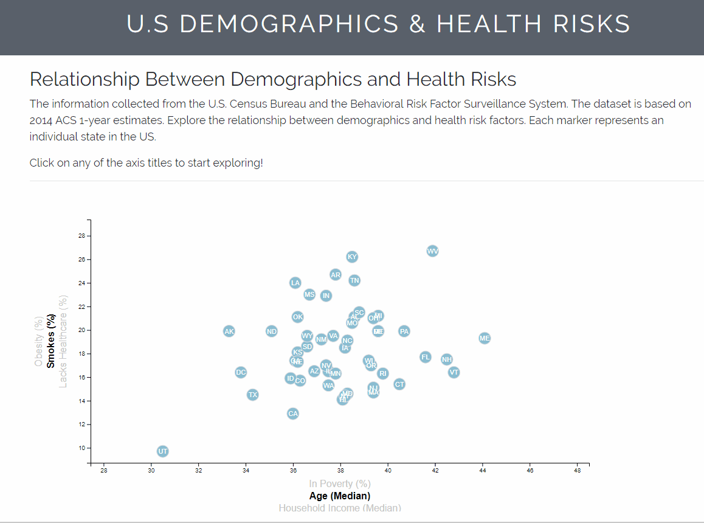

# Data Journalism and D3

The collected information from the U.S. Census Bureau and the Behavioral Risk Factor Surveillance System has been used to explore the relations between demographics and health risk factors. Each marker represents an individual state in the US.

This document was created using D3, JavaScript, HTML, SVG, and CSS.

https://yduong3.github.io/Winter2019_Data_Analytics/13_Data_Journalism_and_D3/data_journalism/index.html

#### Image of Final Chart

